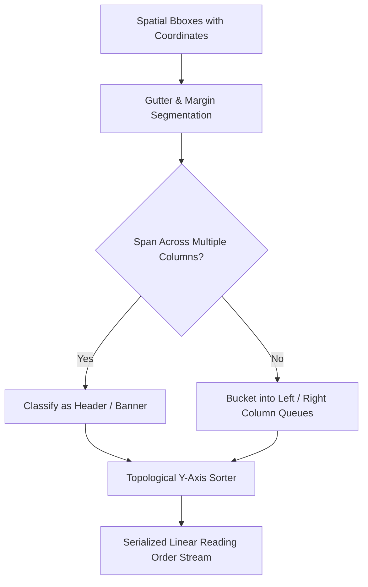

# GenPark AI Agent Skill - Visual Reading Order Topological Sorter

Converts multi-column newspaper layouts and asymmetric bounding box geometries into serialized natural reading sequences.

Verified by [GenPark AI](https://genpark.ai) and compatible with [Model Context Protocol (MCP)](https://genpark.ai/mcp).

## Architecture Diagram

## Features
- **Multi-Column Columnar Disentanglement**: Prevents horizontal cross-column word interleaving errors.
- **Zero Third-Party Dependencies**: Pure Python 3.9+ standard library.
